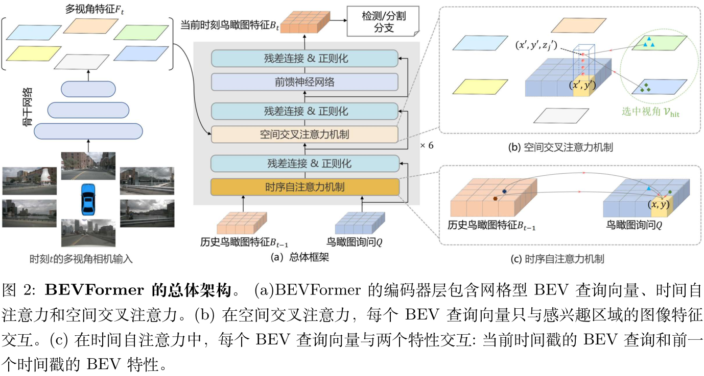

   
  
# BEVFormer: 利用时空 Transformer 从图像中学习鸟瞰图表示

# 摘要
三维视觉感知任务，包括基于多摄像头图像的三维检测和地图分割，是自动驾驶系统的关键。在该研究中，作者提出了一个名为 BEVFormer 的新框架，该框架学习了具有时空 Transformer 的统一 BEV 表征，以支持多个自动驾驶感知任务。简而言之，BEVFormer 利用空间和时间信息，通过预定的网格状 BEV 查询向量与空间和时间域交互。为了聚合空间信息，作者设计了一个空间交叉注意力，每个 BEV 查询向量从跨相机视图的感兴趣区域提取空间特征。对于时间信息，作者提出了一种时间自注意力来递归融合历史BEV信息。所提出的方法在 nuScenes 测试集上的 NDS 指标达到了最新的56.9%，比之前的最佳技术高出9.0 分，与基于 lidar 的基线性能相当。

# Methods

